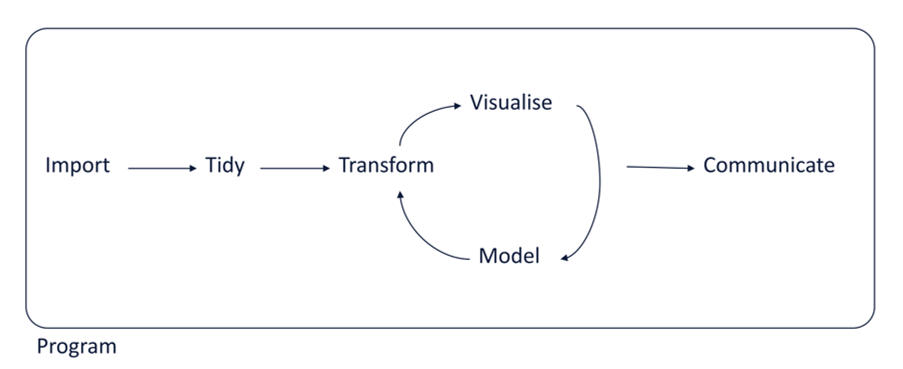
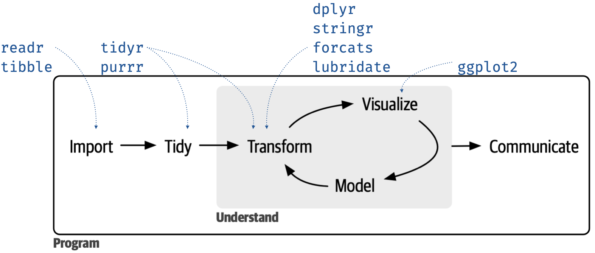
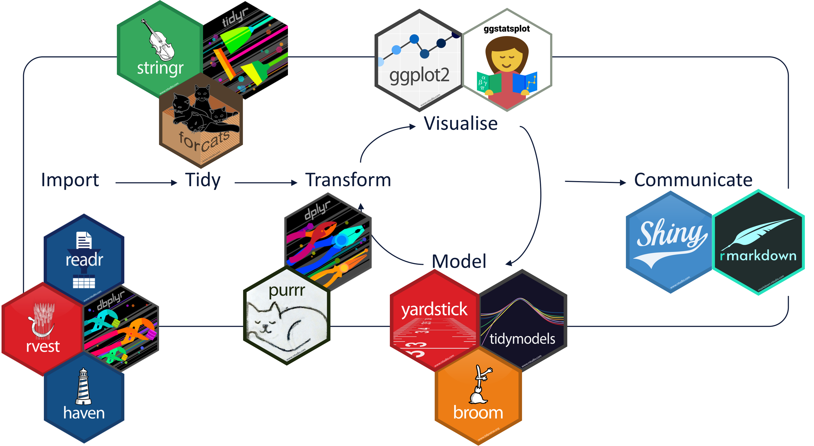
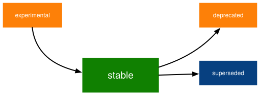
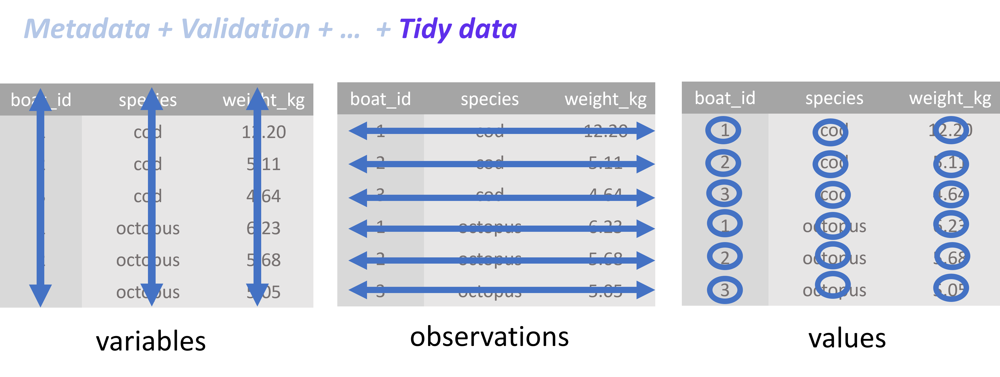
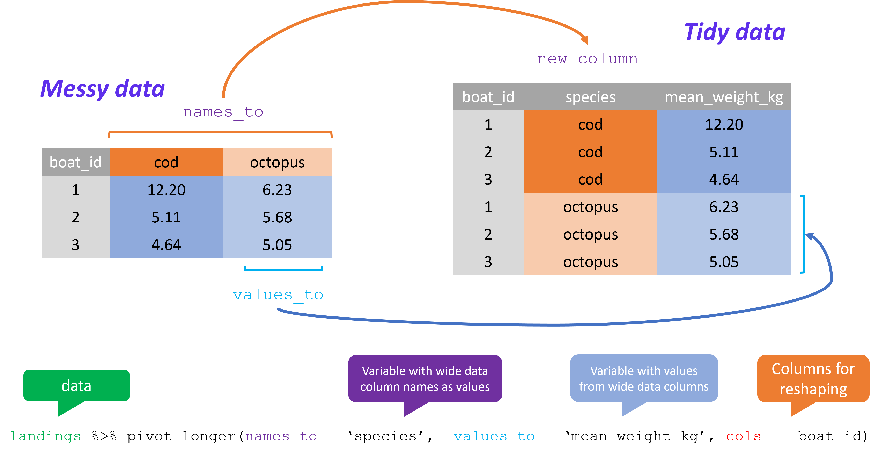
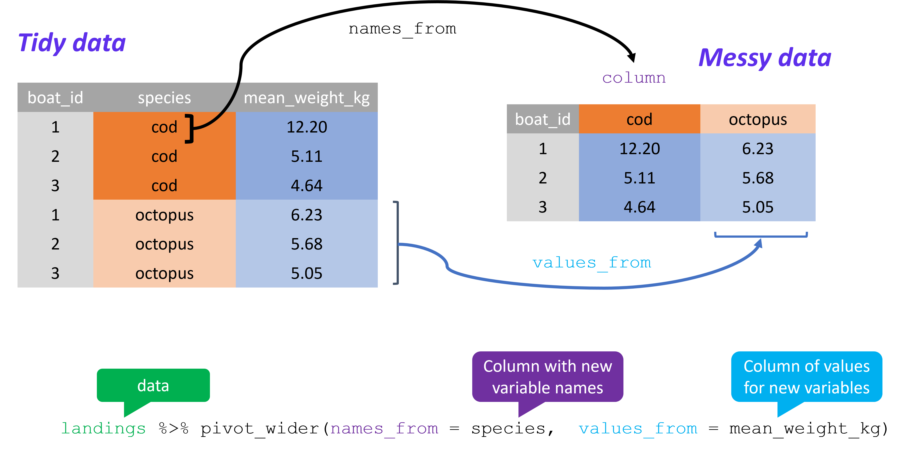
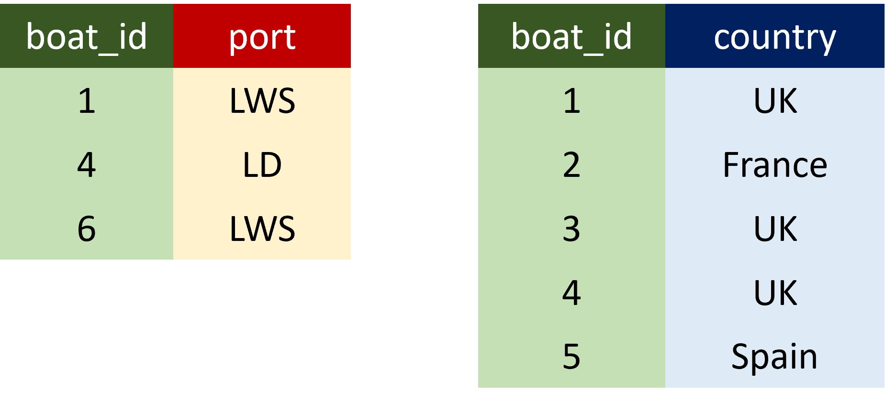
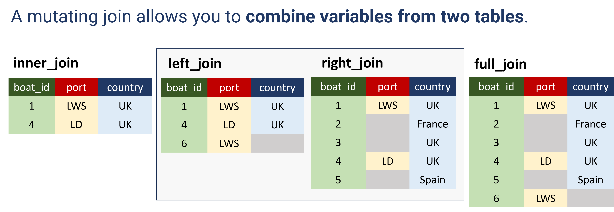
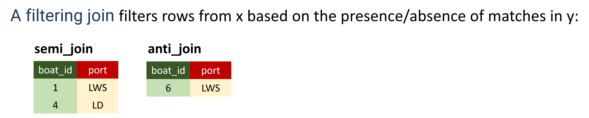

```{r setup, include=FALSE}

knitr::opts_chunk$set(echo = TRUE,warning = FALSE, message = FALSE)


```

```{css, echo=FALSE}

.lightgrey {

background-color:#F6F6F6;

color: #000; font-size:

16px; text-align:left;

vertical-align: middle;

border-radius: 5px;

padding: 20px;

80px

}


body{
  font-family: Helvetica;
  font-size: 14pt;
}

```

------------------------------------------------------------------------

::: lightgrey
**Learning objectives:**

In this session:

-   what is the tidyverse and why you should use it

-   install the tidyverse

-   very brief overview of core functionality and a few available tools

In the following sessions, you will have the opportunity to use the
tidyverse in practice
:::

------------------------------------------------------------------------

# The Data Science Life Cycle

Scientists use data to answer a question, with a number of steps
in-between: need to identify relevant data, import it, transform into a
format that is easy to work with, explore, possibly visualise, analyse,
and communicate their findings.

A typical data science life cycle consists of the following stages:



Source: [R for Data Science (2e) (hadley.nz)](https://r4ds.hadley.nz/),
Hadley Wickham.

------------------------------------------------------------------------

# What is the tidyverse

The tidyverse is "an opinionated collection of R packages designed for
data science. All packages share an underlying design philosophy,
grammar, and data structures." Specifically, it is:

------------------------------------------------------------------------

-   **a metadata package: i**f you install the tidyverse
    (`install.packages('tidyverse'`), you will automatically install a
    set of core packages that provide consistent solutions to various
    steps of the data life cycle



Source:
<https://www.tidyverse.org/blog/2023/08/teach-tidyverse-23/#improved-and-expanded-_join-functionality>

------------------------------------------------------------------------

-   **a R dialect:** alongside the core packages, there is a growing
    number of tidyverse-adjacent packages built on the same principles,
    designed to integrate consistently with the tidyverse. The below is
    just a small sample (some are official but non-core tidyverse, like
    and others, like for instance Shiny and rmarkdown are not yet part
    of the official tidyverse)



------------------------------------------------------------------------

-   **maybe a R subcommunity?** There is a very large number of
    guidelines and resources to promote, teach and provide support for
    this "**opinionated** collection of R packages". For instance, see:

**understand the principles** (including code of conduct!)

<https://design.tidyverse.org/unifying.html> (*"**inclusive**, because
the tidyverse is not just the collection of packages, but it is also the
community of people who use them.")*

------------------------------------------------------------------------

## What the tidyverse is not

-   **not a replacement of base R** (base R is the default R
    installation).

    -   the tidyverse is built on top of base R, not meant to replace it

-   **not something that demands exclusivity**

    -   There are other useful dialects (the faster `data.table`, for
        instance) and you don't need to stick with one exclusively. A
        typical script may combine different dialects


-   **not something that you need to keep up with anxiously**

    -   the tidyverse has a very fast update rate.

    -   during the time scale of a research project of about 2 or 3
        years, you may find that the tidyverse syntax has changed. It
        doesn't mean that your code has become obsolete. If you have
        doubts about a particular function, you can consult its state
        (write ?gather in the console)): by default, functions are in a
        stable state, but:

        <https://lifecycle.r-lib.org/articles/stages.html#superseded>

        *Superseded functions will not receive new features, but will
        receive any critical bug fixes needed to keep it working. In
        some ways a superseded function is actually safer than a stable
        function because it\'s guaranteed never to change (for better or
        for worse).*



------------------------------------------------------------------------

# How to install the tidyverse

```{r}


# Package names
packages <- c('tidyverse', 'palmerpenguins', 'ViewPipeSteps')
              
# Install packages not yet installed
installed_packages <- packages %in% rownames(installed.packages())
if (any(installed_packages == FALSE)) {
  install.packages(packages[!installed_packages], repos = "http://cran.us.r-project.org")
}

# Packages loading
invisible(lapply(packages, library, character.only = TRUE))


```

-   you can also install each package separately using the command install.packages("NAME OF PACKAGE")

------------------------------------------------------------------------

# Two essential tools: pipes and tidy data

------------------------------------------------------------------------

## Pipes

The maigrittr `magrittr::%>%` allows us to chain several chunks of code
together

**Avoid using the pipe when:**

-   You need to manipulate more than one object at a time. Reserve pipes
    for a sequence of steps applied to one primary object.

-   There are meaningful intermediate objects that could be given
    informative names.

    ------------------------------------------------------------------------

### Why use the pipe in other cases? {.tabset}

Piping is used to emphasise a sequence of actions and avoid nested
operations. Let's see the alternatives:

#### Multiple lines of code

```{r}

penguins <- palmerpenguins::penguins 

# load data
data <- palmerpenguins::penguins_raw 

#Visualise the data
glimpse(data) # switches rows and columns on display to allow you to see every column of data
head(data, 5) # gives you first few rows of dataframe (in this case 5)
names(data) #allows you to see the column names in the dataframe

# select columns we want
data <- select(data, "Species", "Body Mass (g)")

#' rename columns (what was the data about exactly??)
data <- setNames(data, c("species", "body_mass_g"))

#visualise the data
glimpse(data) # switches rows and columns on display to allow you to see every column of data
head(data, 5) # gives you first few rows of dataframe (in this case 5)
```

Problem is that as your code grows bigger, you may add things in between
two logical steps. After some time, you may not even remember what data
were you thinking about, and what have you already done with it.

#### Nested code

```{r}

#Example of doing the same as above but in nested format

data <- setNames(select(palmerpenguins::penguins_raw, c("Species", "Body Mass (g)")), c("species", "body_mass_g"))

glimpse(data)
head(data)

```

Problem with nesting is that it will eventually become hard to keep
track of all the brackets and R won't help much. For instance, try removing a bracket
in the chunk above...

#### Piping

```{r}

#This is the same as the two chunks above but with piping
data <- palmerpenguins::penguins_raw %>% 
  dplyr::select(c("Species", "Body Mass (g)")) %>%
  setNames(c("species", "body_mass_g"))


glimpse(data)
head(data)

```

------------------------------------------------------------------------

## Tidy data 

Besides piping, the tidyverse is known for its emphasis on starting
analysis by formatting data into a so-called tidy format. Why a tidy
format?


###  **The essential: settle on a standard and work with it**

Hadley Wickham "tidy datasets are all alike but every messy dataset is
messy in its own way."

Much of the data you come across has personal add-ons: embedded plots,
colours, dates recorded in different formats, unclear column names,
duplicated values, comments and calculations in the raw data files, etc.
This may be helpful for the human brain but not for a programming
language.

By using a consistent data format, the remaining steps of your data
science pipeline will be easier to do and generalise. You'll waste less
time struggling with the remaining data analysis tools and can focus on
analysis.

https://www.tidyverse.org/

### **The standard that R works best with: Tidy Data Principles**

• Each variable has its own column

• Each observation has its own row

• Each value has its own cell



------------------------------------------------------------------------

Let's see a very simple example to show how R prefers tidy data: we will
use the (base R) `summary` function.

### 📝 Try this: {.tabset}

#### Tidy data

See the first 10 rows of the penguins dataset. In the case of Palmer
penguins, a variable refers to an attribute of all the penguins, and an
observation refers to all the attributes of a single penguin.

```{r}

penguins %>% head(10)

```

Use the built-in function summary() to quickly summarise the data

```{r}
summary(penguins) 
```

#### Untidy data

Transform columns into rows and visualise data in R studio: does it look
bad? (Turning into messy from tidy)

```{r}
(penguins %>% t()) %>% View()

```

How about this?

```{r}

summary(penguins%>%t())

```

------------------------------------------------------------------------

### **Tidying data with tidyr**

`tidyr` is one of the packages used to get data into a tidy format.

• **pivot_longer** -- convert to tidy



• **pivot_wider** -- convert to untidy (because there is nothing
intrinsically wrong with it!)



------------------------------------------------------------------------

## Data Manipulation with dplyr

Besides tidyr, dplyr is probably the most widely used tidyverse
package. It is used to manipulate and transform data. The 5 main dplyr
verbs that you will come across many times throughout this course:

**filter:** select a subset of rows/observations

**select:** choose which columns/variables to work with.

**arrange:** change order of rows, by default arranging happens in
ascending order

**mutate:** update or create new columns of a data frame.

**summarise:** turn many observations into a single data point (eg
mean, max)

**group_by:** allows actions to be performed by group (group_by is
often followed by summarise)

[https://teachingr.com/content/the-5-verbs-of-dplyr](https://teachingr.com/content/the-5-verbs-of-dplyr/the-5-verbs-of-dplyr-article.html#:~:text=The%20magic%20of%20dplyr%20is%20that%20with%20just,of%20dplyr%3A%20select%2C%20filter%2C%20arrange%2C%20mutate%2C%20and%20summarize.)

------------------------------------------------------------------------

### Joining datasets

Another very useful dplyr capability that is essential in research, is
to help joining datasets.

{width="329"}





#### ☝️ **There is also `fuzzyjoin::fuzzy_join`** (#allows partial and inexact matching)


::: lightgrey

### **To summarise**:

-   using the tidyverse will help to organise and streamline your data
    analysis workflow in a consistent way

-   it is easy to learn and there is help available: there is a huge
    number of online resources and a very welcoming community organising
    events, meetups, coding clubs\...

    Example: [rfordatascience/tidytuesday: Official repo for the
    #tidytuesday project
    (github.com)](https://github.com/rfordatascience/tidytuesday/tree/master)

In the following sessions, you will have the opportunity to use the
tidyverse and base R in practice
:::


### To finalise, some more resources:

**Here you can see animations of the above:**

<https://tidydatatutor.com/index.html>

<https://www.garrickadenbuie.com/project/tidyexplain/#pivot-wider-and-longer>

**Many cheat sheets:**
[Cheatsheets - Posit](https://posit.co/resources/cheatsheets/)

**learn**

<https://www.tidyverse.org/learn/>

<https://r4ds.hadley.nz/>

[Tidyverse Cheat Sheet For Beginners \|
DataCamp](https://www.datacamp.com/cheat-sheet/tidyverse-cheat-sheet-for-beginners)

<https://rstudio-education.github.io/tidyverse-cookbook/transform-tables.html>

**and practice**

<https://www.jvcasillas.com/untidydata/>
