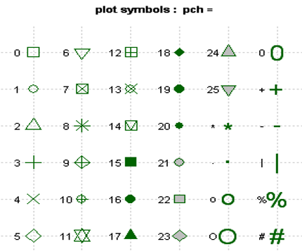
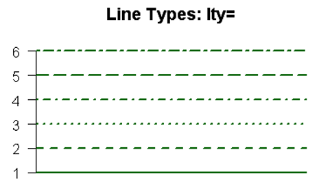

```{r setup, include=FALSE}
library(knitr)
knitr::opts_chunk$set(echo = TRUE)
# knitr::opts_chunk$set(eval = FALSE) ## have set this to FALSE for now, might have to change that if we want to show outputs
```

## Basic example plots

Let's visualise our data using three different types of plots. This can also be a great way to explore your data, for example by plotting a simple histogram or boxplot. You have already heard of the package 'ggplot2'. This is a very powerful package to create great looking plots very quickly. However, sometimes base R code is perfectly sufficient - and may actually give you more flexibility to fully customise your plots - and therefore we will also cover some base R functions as well.

First we will load the `ggplot2` package so we can compare base R functions with `ggplot` functions:

```{r package, warning=FALSE, message=FALSE}
# install.packages("ggplot2")
library(ggplot2)
```

Now let's start with some simple examples for different types of plots. Using the `iris` example data, we can plot some simple histograms, boxplots and scatter plots which allow us to explore our data.

<u>**Histogram**</u>

```{r hist}
## first we create our simple dataframe again:
iris <- as.data.frame(iris)

## then we can plot a histogram of petal lengths:
hist(iris$Petal.Length)

# to change width of bins
#hist(iris$Petal.Length, breaks = seq(min(iris$Petal.Length), max(iris$Petal.Length), length.out = 15))

## and the same using ggplot:
ggplot(data = iris) +
  geom_histogram(aes(x = Petal.Length))
```

<u>**Boxplot**</u>

```{r box}
## this is how a boxplot looks using base R functions:
boxplot(iris$Petal.Length~iris$Species)

## and this is how a boxplot looks using ggplot:
ggplot(data = iris,aes(x = Species, y = Petal.Length)) +
  stat_boxplot(geom = "errorbar", width = 0.15) +
  geom_boxplot()
```

Note here we have directly made boxplots for the three factors we have in our dataset - we can of course make a boxplot for just one of the factors, but usually when making boxplots we want to compare different factors.

<u>**Scatterplot**</u>

```{r scatter}
## a scatterplot using base R -- note here a scatterplot is the default that R will return if we don't specify a specific plot and we are plotting two numerical variables
plot(iris$Petal.Width~iris$Petal.Length)
## alternative way of writing this:
# plot(x = iris$Petal.Length, y = iris$Petal.Width)

## this is how a scatterplot looks using ggplot:
ggplot() +
  geom_point(data = iris, aes(x = Petal.Length, y = Petal.Width))
```

When we don't specify the type of plot we want, the base function gives us different results based on the class of our variable - this isn't always informative!!

```{r plot1}
plot(x = iris$Species) # plotting factors for x

plot(x = iris$Petal.Length) # looks a bit like a histogram? but R returns a scatterplot because it's a numerical value...

plot(x = iris$Species, y = iris$Petal.Length) # here we get a boxplot because one of our variables is a factor
```

<u>**Line plot**</u>

Let's revisit the chicks from yesterday

```{r chickweight}
data("ChickWeight")
#let's plot the weight of chick 2 through time.
chick2 <- ChickWeight[ChickWeight$Chick == 2, ]
plot(x = chick2$Time, y = chick2$weight, type = "l")

ggplot() +
  geom_line(data = ChickWeight[ChickWeight$Chick < 20,], aes(x = Time, y = weight, col = Chick))
#Maybe it is clear now what happened to chick 16 and 18. Perhaps they didn't escape after all.
```


<u>**So what's the difference?**</u>

The two most obvious differences between base R `plot` and `ggplot` are:

- the code/synthax
- the layout and look of the resulting plot

With base R plots, a lot of editing is done with additional lines of code that are technically independent from each other. With ggplot, you add 'layers' to your plot object and with each new layer you can either add more data to your plot or change settings.

We will now look at some simple examples on how to customise plots.

## Customising base R plots
Let's change some basic things about our plot. We'll start with the base R `plot` function first before we move on to the `ggplot` function.

```{r base-plot}
# load the data:
iris <- as.data.frame(iris)

## let's remind us of what the plot looks like if we specify nothing else:
plot(iris$Petal.Length, iris$Petal.Width)

## now we change the axis titles:
plot(iris$Petal.Length, iris$Petal.Width,
     xlab = "Petal Length (cm)",
     ylab = "Petal Width (cm)")

# and what about a title?
mtext(side=3, line=2, at=0.5, adj=0, cex=2, "Sepal width as a function of sepal length")
```

What if we want to change the colour of our points? Or change the type of symbol completely? R has the following options built in for point symbols:




To use one of these options in our plot, here is how we do it:

```{r base-plot2}
plot(iris$Petal.Length, iris$Petal.Width,
     xlab = "Petal Length (cm)",
     ylab = "Petal Width (cm)",
     pch = 17)

## or to change the colour on top of it:
plot(iris$Petal.Length, iris$Petal.Width,
     xlab = "Petal Length (cm)",
     ylab = "Petal Width (cm)",
     pch = 17,
     col = "blue")

```

Note how our title disappeared as we didn't include this command line in our code chunk!

Just as we can change the point symbol, we can also change the line type. Here are the built in options:



So if we want to change the line type in our chick plot from earlier it would look like this:

```{r lty}
# data("ChickWeight")
chick2 <- ChickWeight[ChickWeight$Chick == 2, ]
plot(x = chick2$Time, y = chick2$weight, type = "l", lty = 3)
```


There are many aspects of a plot that can be edited. Things that directly affect parts of the plot - such as the colour of points - can be specified *within* the `plot` function. Anything that concerns the general layout of the plot - such as margins, font size of labels, position of the legend - need to be specified *outside* the `plot` function. We've seen this with the title - we used `mtext()` for this. Another important function is `par()`. Within this function, we can specific parameters that define the general layout of our plot. For example, let's create very large outer margins, and change the colour of our axis labels to green:

```{r base-plot3}
# we have to define out plotting window BEFORE we plot:
par(oma = c(5,5,5,5), col.lab = "darkgreen") # for reference: c(bottom, left, top, right)

plot(iris$Petal.Length, iris$Petal.Width,
     xlab = "Petal Length (cm)",
     ylab = "Petal Width (cm)",
     pch = 17,
     col = "blue")
```

The documentation for this function gives you an overview of all the different parameters that can be changed with this function:
https://www.rdocumentation.org/packages/graphics/versions/3.6.2/topics/par

You will find a lot of things will be learned by 'trial and error'...

**An important note:** the `par` function changes *global* settings for ALL subsequent plots -- that means if you want to reset your settings to the default, or you get lost down a rabbit hole and want to start fresh, use `dev.off()`

Final example - let's group colourings by factor, and add a legend.

```{r base-plot4}
plot(iris$Petal.Length, iris$Petal.Width, col=iris$Species,
     xlab = "Petal length (cm)", ylab = "Petal width (cm)")
#legend(7,4.3,unique(data$Species),col=1:length(data$Species),pch=1)
legend('bottomright', legend = levels(iris$Species), col = 1:3, cex = 0.8, pch = 1)


```

## ggplots and how to customise them
As you can probably tell by the previous examples, `ggplot` code looks different to base R plotting, and we need to write our code differently to achieve the same effects.

`ggplot` builds up a plot layer by layer. If we were to call an empty `ggplot()` function, we are essentially telling R to set up an empty plotting window: 

```{r ggplot1}
ggplot()
```

Now we can add content to that empty box. You can specify which data to use in two places -- if you are only using one dataset, you can define your data at the start, if you will be plotting multiple datasets on top of each other (yes this is possible), you can define the data within each layer. Example:

```{r ggplot2}
ggplot(data = iris) +
  geom_point(aes(x = Petal.Length, y = Petal.Width))

# this gives the same results:

ggplot() +
  geom_point(data = iris, aes(x = Petal.Length, y = Petal.Width))
```

Different types of plots in `ggplot` are defined by different *geoms*. Here is a list to give you an overview:

https://ggplot2.tidyverse.org/reference/

This also shows us that in our example *geom_point* is the first layer that we add to our ggplot. The second important thing to understand about `ggplot` is the `aes()` function -- here we define *aethetics* of our variables. Just like with the `plot()` function we need to learn where in the function we define our parameters. For example, let's recreate our scatterplot to demonstrate:

```{r ggplot3}
ggplot(data = iris) + # define data, we could even add x and y definitions here
  # changing point colour AND symbol based on factor
  geom_point(aes(x = Petal.Length, y = Petal.Width, colour = Species, pch = Species))+
  labs(title = "Petal Width as a function of petal length",
       x = "Petal length (cm)",
       y = "Petal width (cm)") +
  theme_bw()+ # NOTE: here the order matters! We set the overall theme first then overwrite parts of it
  theme(axis.title = element_text(size=10, face="bold", color = "black"))
  
```

Things that directly affect our variables - the colour and point shape - are defined within the `aes()` function. General settings need to be defined *outside* of the plotting function and added as new layers with a +

`ggplot` was developed to make plotting easier -- note for example that a legend was added automatically. For the vast majority of plots, this additional functionality is great and will allow you to do whatever you need. For some plots, the base R functions are better suited because they allow you to build up plots bit by bit, completely manually and from scratch.

## How to save plots
There are several options to save plots. In an R script, you can use the 'save plot' button above the plotting window. For ggplot, you can use `ggsave()` where you can define the location, format (jpeg, png, pdf) and dimensions of your outputs. You can also "print" to pdfs and pngs. 

## Some further thoughts on plotting and online resources
There are many other things you can customise about your plots - both using base R functions and ggplot. There are also many other base R functions to produce specific statistical plots. Some examples of other things you can do when plotting:

- add labels/textboxes
- add trendlines
- plot outputs from statistical models, or plot error distributions
- customise the colour palette used in your plots -- there are many palettes to choose from!
- arrange multiple plots, either using the `par` function, or using packages such as `cowplot`
- change the font size, style and angle of axis lables and tick marks
- create interactive plots using packages such as `plotly` (this is a whole universe in its own)
- plot spatial data using base R, ggplot or packages such as `leaflet` (another vast area we haven't explored)
- create animations and gifs which can be embedded into documents or exported as gifs


Like with many other things you can do in R, there are endless resources out there to help you! It is safe to assume that any plot customisation you want to do, someone else has already tried it and has asked the internet community for help (or went and wrote a book about it). Here are some links to get you started and to give you an idea of all the things you can look up online:

https://www.datanovia.com/en/lessons/introduction-to-ggplot2/

https://datacarpentry.org/R-ecology-lesson/04-visualization-ggplot2.html

https://stackoverflow.com/questions/57153428/r-plot-color-combinations-that-are-colorblind-accessible

## Basic plot editing
- ggplot etc, including how to export for publications, leaflet
- histogram - in base plot and ggplot -- done
- basic scatter plot - in base plot and ggplot -- done
- adding labels etc
- adding lines
- grouping by factors -- done
- adding trendlines
- saving plots
- interactivity with plotly
- cowplot for panels
- sizing, formatting etc.
- plotting spatial data - with ggplot, and with leaflet.
- animations - basic gif


## Accessibility
Accessibility is essentially the ability to access or benefit from something. It focuses on making sure that content we produce can be used by as many people as possible, regardless of any disabilities they might have. For example, making sure that someone with impaired vision or colorblindness can access it.
For those of us working for Cefas this is especially important as all public sector bodies have to meet the [2018 accessibility regulations](https://www.legislation.gov.uk/uksi/2018/852/contents/made), but it is good practice for everyone to make an effort to make their content accessible, so that barriers are removed as far as possible and no one is excluded from using something on the basis of a disability. There is a [government accessibility blog](https://accessibility.blog.gov.uk/2016/05/16/what-we-mean-when-we-talk-about-accessibility-2/) which goes into more detail on this subject.

So, what does this mean practically for us as R coders creating content like maps and charts, or even markdown documents like this one?

### Hyperlinks, html tags etc

An accessible link is one which makes sense without any context. For example in the paragraph above I linked to a blog. Rather than just pasting the url or saying click [here](https://accessibility.blog.gov.uk/2016/05/16/what-we-mean-when-we-talk-about-accessibility-2/) for info, I hyperlinked it with the text ["government accessibility blog"](https://accessibility.blog.gov.uk/2016/05/16/what-we-mean-when-we-talk-about-accessibility-2/) so that it would be clear to anyone using a screen reader where the link is going to take them.

### Alternative text
When designing a figure, try to keep in mind that someone may be be looking at your figure in a document while using a screen reader, and cannot actually see it. As a starting point alt text should tell the person what the figure is. For example "the logo of Rstudio".


Where images are just there to fill space or look pretty it can be enough just to say "decorative image".


(want to figure out how to make alt text separate to caption)

However, much of the content we are producing with R is conveying information, and we need to be sure that information is as accessible as possible. A caption can provide some detail, for example "Figure 1: A bar chart showing favourite foods among participants." This is enough information for someone who can see the chart to understand what they are looking at, but is not detailed enough for alt text. Alt text might say "A bar chart showing favourite foods among participants. Pizza is the most popular food, preferred by 8/25 participants, closely followed by chocolate (6/25) and cheese (5/25). Several other food types were mentioned by one or two participants."

how to add alt text to tables

### Colour blindness
One of the biggest issues with figures we are producing is the tendency to use colour to convey information. For example, in the following line plot, colour is used for the different series. This means that for someone who is unable to differentiate these it can be very difficult if not impossible to gain any information from.

While colour is very useful for those of us who can see it, we should avoid using it as the only way to convey information. We could add labels to each line alongside the colour, now someone who can't distinguish the colours can still tell the series apart. Or we could use symbols.

In some instances it can be much harder to avoid use of colour. For example, in this map showing satellite temperature records in the North Sea. We cannot add labels or symbols to each cell without the map becoming impossible to read. However, we can carefully chose colour ramps which are colour blind friendly.

Show orginal example with a poor choice of colour ramp, inc what it looks like to someone with red-green colour blindness. Then show example with a better colour ramp.

Fortunately we do not all need to become experts in colour blindness, there are colour ramps and R packages already out there which we can make use of.

colour ramps - continuous and discrete data
https://stackoverflow.com/questions/57153428/r-plot-color-combinations-that-are-colorblind-accessible

https://www.jumpingrivers.com/blog/accessible-shiny-standards-wcag/
standards, why it is important

labels

## Exercise
Give a few basic plots that are not accessible and ask them to make them into accessible ones.


text size
html tags
screen readers

further reading - gov digital service, w3c

https://www.w3schools.com/accessibility/index.php
"This is a tooltip :)"