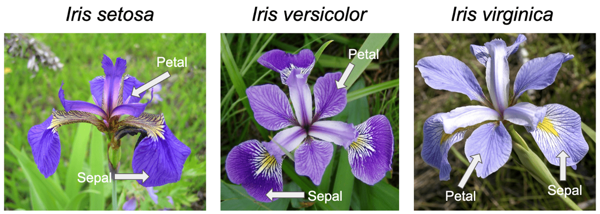
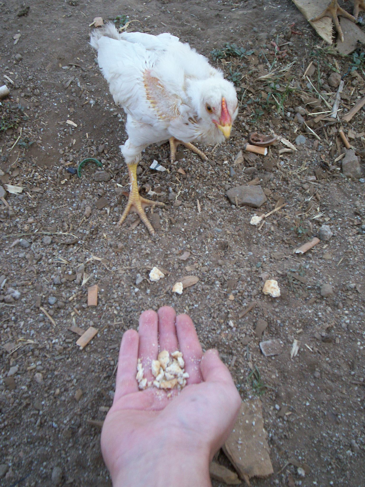
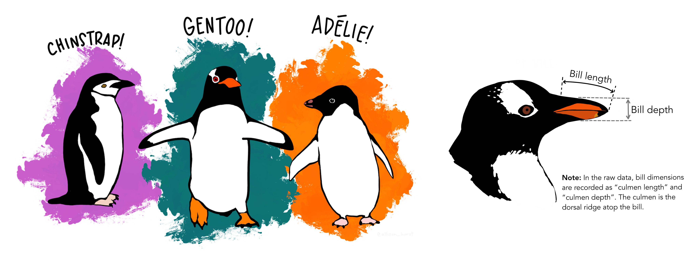

```{r setup, include=FALSE}

knitr::opts_chunk$set(echo = TRUE, warning = FALSE, message = FALSE)

```

```{css, echo=FALSE}

.lightgrey {
background-color:#F6F6F6;
color: #000; font-size:
16px; text-align:left;
vertical-align: middle;
border-radius: 5px;
padding: 20px;
80px

}

body{
font-family: Helvetica;
font-size: 14pt;
}

div[style^='callout:'] {
padding: 20px;
margin: 20px 0;
border: 1px solid #eee;
border-left-width: 6px !important;
border-radius: 3px;
}

div[style^='callout:'] h4 {
margin-top: 0;
margin-bottom: 1em;
}
div[style^='callout:'] p:last-child {
margin-bottom: 0;
}

div[style^='callout:'] code {
border-radius: 3px;
}

div[style^='callout:']+div[style^='callout:'] {

margin-top: -5px;

}

div[style='callout:default'] {
border-left-color: #777 !important;
}
div[style='callout:default'] h4 {
color: #777 !important;
}

div[style='callout:primary'] {
border-left-color: #428bca !important;
background-color: #ebf5ff  !important;
}
div[style='callout:primary'] h4 {
color: #428bca !important;
}

div[style='callout:success'] {
border-left-color: #5cb85c !important;
background-color: #f6fef6  !important;
}
div[style='callout:success'] h4 {
color: #5cb85c !important;
}

div[style='callout:danger'] {
border-left-color: #d9534f !important;
}
div[style='callout:danger'] h4 {
color: #d9534f !important;

}

div[style^='callout:warning'] {
border-left-color: #f0ad4e !important;
}
div[style^='callout:warning'] h4 {
color: #f0ad4e !important;
}

div[style^='callout:info'] {
border-left-color: #5bc0de !important;
background-color: #F6F6F6  !important;
}
div[style^='callout:info'] h4 {
color: #5bc0de !important;
}


```

------------------------------------------------------------------------

::: {style="callout:success"}
**We asked you:**

*How will learning R benefit your work / job role and what are the
applications where you would use R*

**Some of you answered:**

-   regular testing statistical

-   understanding and running PCA analysis

-   summarise large datasets

-   analyse and model data

-   statistical modelling community effects in ecology and
    spatial/temporal variability in population structure changes

-   ANOVA, mixed effects and generalised linear models distribution and
    abundance plots run statistics i.e., GLMs on data hydrodynamic
    modelling, doing stats on data infer relationships biodiversity
    statistics.

-   In-depth statistical analyses

**Although I wouldn't necessarily call some of the above *basic*, that
is relative, so I used the list as a basis to select topics for this
session on statistics.**
:::

------------------------------------------------------------------------

## Packages

We will use several packages, such as

-   `skimr` and `DataExplorer`: automatic data exploration

-   `naniar`: patterns of missing values

-   `corrplot` and `GGally`: visualise correlations

-   `factoextra`: visualise Principal Components Analysis (PCA) results

-   `lme4`: mixed effects models

(we will not have time to use `tidymodels` for modelling and machine
learning, but it is worth mentioning)

```{r packages}

# packages needed for this session

stats_session_packages <- c('tidyverse', 'palmerpenguins',
'microbenchmark', 'skimr', 'ggplot2', "naniar", "tidymodels",
'corrplot', 'GGally','lme4', 'DataExplorer', 'factoextra', 'janitor', 'gridExtra')

# use %in% operator to see if each of the stats_session packages are part of the installed.packages

installed_packages <- stats_session_packages %in%
rownames(installed.packages())

# Install packages not yet installed

# Install packages not yet installed
if (any(installed_packages == FALSE)) {
  install.packages(stats_session_packages[!installed_packages], repos = "http://cran.us.r-project.org")
}

# Loading (you will learn what lapply() is in this session!)

invisible(lapply(stats_session_packages, library, character.only =
TRUE))

```

------------------------------------------------------------------------

### The *stats* package

The list of packages to install doesn't seem to include options to do
statistical testing or other essential statistical operations. We can
use the `stats` package for that, which is installed by default when we
install R.

☝️ **R is a statistical programming language:** by default, it includes
many statistical functions.

::: {style="callout:primary"}
**Practice:** uncomment (remove `#`) the lines of code below, one by
one, to see a list of the many statistical analysis you can do with the
`stats` package, and to get information on two examples of statistical
tests:
:::

```{r statslang, error=TRUE}

#library(help = "stats")

#?chisq.test

#?t.test

```

## Data: load data, look at data

We will work with three main datasets: the *Iris* and the *ChickWeight*
datasets from the `datasets` package (installed by default), and the
*Palmer penguins* dataset from the `palmerpenguins` package (needed to
install above).

```{r loaddata, warning=FALSE}

#'add suffix orig from original, to revert to it in case of need

#' iris_orig: iris data from the datasets package
iris_orig <- datasets::iris

chick_orig <- datasets::ChickWeight

penguins_orig <- palmerpenguins::penguins

```

------------------------------------------------------------------------

### Iris dataset



We can use the `glimpse` function of the `dplyr` package to see a list
of the number or records/rows and variables/columns, as well as the type
and examples of each variable.

```{r}

dplyr::glimpse(iris_orig)

```

### Chick weight

The ChickWeight data frame is a simple longitudinal study of several
diets and their impact on chick body weights.

{width="235"}

[File:Gallus gallus domesticus.JPG - Wikimedia
Commons](https://commons.wikimedia.org/wiki/File:Gallus_gallus_domesticus.JPG)

We can use the function `head` to get a table of the first `n` rows of
the data. The function `tail` would give you the last `n` rows.

```{r}

chick_orig <- ChickWeight

#' replace the value of n by the number of rows you want to see
head(chick_orig, n = 4) 

#' uncomment to see the last n rows
#' tail(chick_orig, n = 4) 

```

### Palmer penguins

Data were collected and made available by Dr. Kristen Gorman and the
Palmer Station, Antarctica LTER [palmerpenguins R data package •
palmerpenguins
(allisonhorst.github.io)](https://allisonhorst.github.io/palmerpenguins/index.html)



Artwork by @allison_horst

The base function \`summary()\`, or the alternative \`skimr::skim()\`,
are usual starting points to get a feel for the data:

```{r}

skimr::skim(penguins_orig)


```

::: {style="callout:primary"}
**Practice:** To see how summary works, uncomment the line below and
replace '\_\_\_' by the dataset that you want to summarise.
:::

```{r error=TRUE}

# summary(---)
```

------------------------------------------------------------------------

#### Visualise

A simple call to \`plot\` function already gives you a lot of
information: you can glimpse how variables are distributed and vary with
each other.

```{r}
# Green, Orange, Purple

pCol <- c('#057076', '#ff8301', '#bf5ccb')

names(pCol) <- c('Gentoo', 'Adelie', 'Chinstrap')

plot(penguins_orig, col = pCol[penguins_orig$species], pch = 19)
```

::: {style="callout:primary"}
**Practice:** Plot the iris dataset, in a similar way to the plot above.
Fill the \*\*\`\-\--\`\*\*

-   Hint: do unique(iris_orig\$Species) to know the name of all the iris
    species
:::

```{r, error=TRUE, highlight=TRUE}
# 
#' choose colors
pCol <- c('---', 'red', 'dodgerblue')

#' which are the species of iris? 
names(pCol) <- c('---', 'setosa', '---')

plot(---, col = pCol[iris$Species], pch = 19)
```

::: {style="callout: default"}
**Solution**: click Show button
:::

```{r, class.source = 'fold-hide'}

#'----------
#' build a named vector: values will be the colors and names will be the names of the species
pCol <- c('green', 'red', 'dodgerblue')

#' which are the species of iris? unique(iris_orig$Species)
names(pCol) <- c('virginica', 'setosa', 'versicolor')

#' uncomment below to see pCol
#' pCol
#'---------

#' plot the iris_origin data
plot(iris_orig, col = pCol[iris$Species], pch = 19)

```

------------------------------------------------------------------------

#### 

### Missing data

Finding missing values - amount and patterns - is an important task
during exploratory data analysis. It affects the uncertainty and
validity of statistical analysis.

The `naniar` package is one example of a R package that helps with this
task. We can see, for instance, what is the percentage and number of
missing values for each variable in the *Penguins* data.

```{r}

# Get number of missings per variable (n and %)
miss_var_summary(penguins_orig)

```

The most commonly missing variable is `sex`. But it is not missing at
random. Is it harder to recognise the sex of some species of penguins?

```{r misdata}


#' missingness broken down by species
naniar::gg_miss_fct(penguins_orig, fct = species)

```

Or maybe `species` and `sex` of penguins are both correlated with
something else?

::: {style="callout:primary"}
**Practice**: use `naniar` to get a heatmap of missingness broken down
by island. Fill \`\_\_\_\` below
:::

```{r, error=TRUE}

gg_miss_fct(---, fct = ---)

```

::: {style="callout:default"}
**Solution:** click Show button
:::

```{r, class.source = 'fold-hide'}

gg_miss_fct(penguins_orig, fct = island)

```

------------------------------------------------------------------------

::: {style="callout:primary"}
**Practice**: In case you have many variables, you may want to focus on
only a few. What would you do to investigate if the patterns of penguins
missing data vary over the years, but focusing only on those variables
that have at least one missing value?

-   Use the `naniar` function `miss_var_summary` function to know which
    variables have missing values, and the `gg_miss_fct` function to
    visualise patterns.

-   Use the functions `select` and `filter` from `dplyr` (see this
    course, previous session on the tidyverse) to select the relevant
    variables (columns), filtered by the relevant cases (having at least
    some missing values)

-   Use the penguins_orig example of data, to see the patterns of
    missing data by each year. Fill '\_\_\_' below.
:::

```{r, error=TRUE}

# hint: uncomment below to remember columns of this table
# miss_var_summary(penguins_orig) 

#' vector of variables with at least one missing value
miss_vars <- miss_var_summary(penguins_orig) %>%
  filter(___) %>% # fill this with condition for missing values
  select(variable) %>%
  pull()

#' what are the variables of interest?
focus_vars <- c(miss_vars, '___') # remember that you want to see by year

# data, focusing on the relevant columns
focus_penguins <- penguins_orig %>%
  select(__) # select columns that you want to focus on

#' visualise
gg_miss_fct(___, fct = year) # fill with data 

```

::: {style="callout:default"}
**Solution:** click Show to see solution. Notice that you don't see
`species` or `island` in the plot. That is because they have no missing
values.
:::

```{r, class.source = 'fold-hide'}


# miss_var_summary has 3 columns: variable, n_miss, pct_miss: you can use it to see the names of variables, and which variables have missing values (number/percentage missing larger than zero)
# miss_var_summary(penguins_orig) 


#' vector of variables with at least one missing value
miss_vars <- miss_var_summary(penguins_orig) %>%
  filter(pct_miss > 0 ) %>% # filter by percentage of missing > 0
  select(variable) %>% # select columns with pct_miss > 0
  pull() # to transform into vector

#' what are the variables of interest? The varables with any missing value (miss_vars AND THE year) because we want to see patterns by year. 
focus_vars <- c(miss_vars, 'year')


#' data to focus on: original data, with relevant columns
focus_penguins <- penguins_orig %>%
  select(focus_vars)

#' use this data, to see patterns of missing values by year
gg_miss_fct(focus_penguins, fct = year)

```

::: {style="callout:warning"}
In the exercise above you removed columns that had no missing values at
all.

If instead you wanted to r**emove columns where all values were
missing**, you could use:
:::

```{r}

penguins_remcols <- janitor::remove_empty(penguins_orig, which='cols')

# note: to remove rows with all missing values, chose which = 'rows'

```

::: {style="callout:warning"}
If you wanted to **remove rows with at least one missing value** you
could do:
:::

```{r}

penguins_omit <- stats::na.omit(penguins_orig)

#' are there sill variables with missing values? Uncomment and replace below

#miss_var_summary( --- ) # solution: miss_var_summary(penguins_omit)
```

**Further reading**

[Getting Started with naniar • naniar
(njtierney.com)](https://naniar.njtierney.com/articles/naniar.html):
more things to do with `naniar`

[Working in R - 24  Handling missing values
(biostats-r.github.io)](https://biostats-r.github.io/biostats/workingInR/050_missing_values.html):
how to handle missing values

------------------------------------------------------------------------

#### Automatic EDA

Exploratory data analysis is an iterative process that must be tailored
to your specific data. However, as a starting point and to get ideas on
what to explore, you can use packages such as \`DataExplorer\`. This
will give you a summarised report on your data. Uncomment below to
create a report:

```{r}

#DataExplorer::create_report(penguins_orig)
```

**Further reading:**

[Simple Fast Exploratory Data Analysis in R with DataExplorer
Package\|by AbdulMajedRaja RS \| Towards Data
Science](%5Bhttps://towardsdatascience.com/simple-fast-exploratory-data-analysis-in-r-with-dataexplorer-package-e055348d9619)](<https://towardsdatascience.com/simple-fast-exploratory-data-analysis-in-r-with-dataexplorer-package-e055348d9619>))

------------------------------------------------------------------------

# ANOVA

The iris data set in R is commonly used to predict the Species based on
all other features. To get a broad overview into how different species
are, we can use a matrix of plots (package \`GGally\`). The
characteristics of each species are seen in a different colour. It is
clear that the mean of the sepal length varies by species. But is this
significant?

```{r}

ggpairs(iris_orig, 
        mapping = aes(color = Species), 
        columns = colnames(iris_orig))

```

The variable \`Species\` can be seen as an independent variable to
conduct an ANOVA test. This is a statistical test to check three or more
differences in group means. The code snippet below performs an ANOVA
test using the `iris` dataset (specified by the `data` parameter),
specifically analyzing the `Sepal.Length` variable across different
`Species` categories (`formula` parameter defines the relationship to be
tested).

```{r}

anova_model <- aov(data = iris_orig, formula = Sepal.Length ~ Species)

summary(anova_model)

#' you could plot the model to check if it meets some ANOVA assumptions (eg normality)
# plot(anova_model)
```

The low p-value (three *stars \*\*\**) indicates strong evidence against
the null hypothesis, suggesting that at least one group mean is
significantly different from the others. The F-statistic measures the
ratio of the variance between group means to the variance within groups.
A higher F-value indicates a greater difference between group means.

::: {style="callout:primary"}
**Practice:** The documentation on the function is accessible by running
\`?aov\` in the console. Do this to find the meaning of the column
\`Pr(\>F)\` from the summary table, as well as examples and references.
:::

[When to Use aov() vs. anova() in R -
Statology](https://www.statology.org/aov-vs-anova-in-r/)

Besides ANOVA, there are many statistical tests implemented in R.

**Further reading:**

[Analysis of the Iris Dataset
(rstudio-pubs-static.s3.amazonaws.com)](https://rstudio-pubs-static.s3.amazonaws.com/751627_c46e38ce93da44659a5f4fb753c62dd2.html)

(What statistical analysis should I use? Statistical analyses using
R(ucla.edu))(<https://stats.oarc.ucla.edu/r/whatstat/what-statistical-analysis-should-i-usestatistical-analyses-using-r/>))

[18 Simple statistical tests \| The Epidemiologist R
Handbook(epirhandbook.com)](%5Bhttps://epirhandbook.com/en/simple-statistical-tests.html)](<https://epirhandbook.com/en/simple-statistical-tests.html>))

<https://statsandr.com/blog/files/overview-statistical-tests-statsandr.pdf>)

Plots that include statistical details:

[Introduction to {ggstatsplot}: {ggplot2} Plots with
Statistics(indrajeetpatil.github.io)](%5Bhttps://indrajeetpatil.github.io/ggstatsplot_slides/slides/ggstatsplot_presentation.html#12)](<https://indrajeetpatil.github.io/ggstatsplot_slides/slides/ggstatsplot_presentation.html#12>))

[T-test and ANOVA on Iris Data
(rstudio-pubs-static.s3.amazonaws.com)](https://rstudio-pubs-static.s3.amazonaws.com/637399_747e10899e61480c8f703df7383aab7a.html)

------------------------------------------------------------------------

# Principal component analysis

To visualize high-dimensional data, we use PCA to map data to lower
dimensions. The method is particularly useful when the variables within
the data set are highly correlated. Due to this redundancy, PCA can be
used to reduce the original variables into a smaller number of new
variables ( = *principal components*). These will not be a reduced
portion of the original variables, it will be different variables!

We can do PCA in R in different ways, for instance

\- `prcomp`() [built-in R `stats` package],

\- `PCA`() [`FactoMineR` package, useful for visualisation],

**The basic syntax is:**

::: {style="callout:default"}
prcomp(x, ...)
:::

Arguments for `prcomp()`:

-   x: a numeric matrix or data frame

::: {style="callout:warning"}
**Note:** run `?prcomp` on the console to check for other possible
arguments, besides `x`

Of the possible arguments, note that `scale` is set as FALSE. This is a
logical value indicating whether the variables should be scaled to have
unit variance before the analysis takes place.
:::

However, it is recommended to set the argument `scale=TRUE` to
standardise the input data so that it has zero mean and variance one
before doing PCA. This is particularly recommended when variables are
measured in different scales (e.g: kilograms, grams).

Therefore, we will set the `scale` parameter to TRUE.

::: {style="callout:default"}
prcomp(x, scale = TRUE)
:::

::: {style="callout:primary"}
**Practice:** run PCA on 4 columns of the iris data.

\- which four columns? (Hint: run `?prcomp)` **x:**a numeric or complex
matrix (or data frame) which provides the data for the principal
components analysis.)

\- replace \`\-\--\` below by the appropriate terms.
:::

```{r, error=TRUE}


#' focus on the four columns
iris_4 <- iris_orig %>%
  select(- ___) #' which column to deselect?

#' do PCA
iris_pca <- prcomp( --- , scale = ---)

```

::: {style="callout:default"}
**Solution:** click Show button
:::

```{r, class.source = 'fold-hide'}

#' (do ?prcomp in the console), data x (eg iris_orig) must be numeric. Use `str` to see the type of each column: Species is a factor 

iris_orig %>% str()

#' focus on the first four columns, which are numeric
iris_4 <- iris_orig %>%
  select(-Species) #' deselect (using minus) non-numeric Species

#' do PCA on the numeric columns. Don't forget scale=TRUE
iris_pca <- prcomp(iris_4, scale = TRUE)

# Look at the results.
iris_pca 

```

### Visualise results

Although the default `stats` package includes options to produce many
PCA visualisations, I find it easier to customise `factoextra`. We will
run just a few examples, but you can find other options online, for
instance here:

[PCA - Principal Component Analysis Essentials - Articles
-STHDA](%5Bhttp://www.sthda.com/english/articles/31-principal-component-methods-in-r-practical-guide/112-pca-principal-component-analysis-essentials/)](<http://www.sthda.com/english/articles/31-principal-component-methods-in-r-practical-guide/112-pca-principal-component-analysis-essentials/>))

#### Scree plot

Visualizing the variance explained by each component helps us to
visually identify how many principal components are needed.

The percentage of variances captured by each of the new coordinates,

```{r}

var_explained = iris_pca$sdev^2 / sum(iris_pca$sdev^2)

#create scree plot
qplot(c(1:4), var_explained) + 
  geom_line() 

#calculate total variance explained by each principal component

factoextra::fviz_eig(iris_pca, addlabels = TRUE, ylim = c(0, 50))

#'?screeplot

```

```{r}

fviz_pca_ind( iris_pca ,
             geom.ind = "point", # show points
             col.ind = iris$Species, # color by species, iris$Species
             palette = c("#00AFBB", "#E7B800", "#FC4E07"),
             addEllipses = TRUE, # Concentration ellipses
             legend.title = "Groups"
             )
```

------------------------------------------------------------------------

#### Variable correlation plot

In this plot:

\- Positively correlated variables are grouped together: Petal length
and Petal width

\- Negatively correlated variables are positioned on opposite sides of
the plot origin (opposed quadrants): sepal width and petal length?

```{r}

fviz_pca_var(iris_pca, col.var = "black")
```

We can do a correlation plot to check if the interpretation of the plot
above sounds right: petal length is very positively correlated with
petal width and anticorrelated with sepal width.

```{r}
#' correlation
M <- cor(iris[,-5])

corrplot::corrplot(M, method = 'ellipse', type = 'lower', diag = FALSE)
```

We are not investigating correlations between features in the same
flower. In this case, the results reflect the fact that Iris Virginica
often have longer petal length and width than Iris setosa, but Iris
setosa often have the greatest sepal width. The same result is confirmed
looking at the column Species (boxplots) of the first plot in the ANOVA
section.

The function \`fviz_contrib()\` can be used to draw a bar plot of
variable contributions to the principal components.

```{r}
# Contributions of variables to PC1

fviz_contrib(iris_pca, choice = "var", axes = 1)

# Contributions of variables to PC2
fviz_contrib(iris_pca, choice = "var", axes = 2)
```

::: {style="callout:warning"}
**Note:** we have been using the default method for `prcomp`. But you
may see a formula being used instead of data. See documentation
`?prcomp`

For instance, PCA on penguins dataset may look like:
:::

```{r}

penguins_visl <- penguins_orig %>%
  mutate(species = as.factor(species),
         island = as.factor(island),
         sex = as.factor(substr(sex,1,1))) %>%
  na.omit()


#' Notice the formula: ~bill_length_mm + bill_depth_mm + ...
penguins_pca <- prcomp(~ bill_length_mm + bill_depth_mm + 
                               flipper_length_mm + body_mass_g,
                             data=penguins_visl,
                             na.action=na.omit,  
                             scale. = TRUE)


penguins_pca
```

------------------------------------------------------------------------

**Further reading:**

PCA using the
[recipes](%5Bhttps://recipes.tidymodels.org/)](<https://recipes.tidymodels.org/>))
package from

[tidymodels](%5Bhttps://www.tidymodels.org/)](<https://www.tidymodels.org/>))

[PCA with penguins and recipes •
palmerpenguins(allisonhorst.github.io)](%5Bhttps://allisonhorst.github.io/palmerpenguins/articles/pca.html)](<https://allisonhorst.github.io/palmerpenguins/articles/pca.html>))

Using the factoextra package

[PCA - Principal Component Analysis Essentials - Articles
-STHDA](%5Bhttp://www.sthda.com/english/articles/31-principal-component-methods-in-r-practical-guide/112-pca-principal-component-analysis-essentials/)](<http://www.sthda.com/english/articles/31-principal-component-methods-in-r-practical-guide/112-pca-principal-component-analysis-essentials/>))

[PCA with tidyverse - Benjamin
Nowak(bjnnowak.netlify.app)](%5Bhttps://bjnnowak.netlify.app/2021/09/15/r-pca-with-tidyverse/)](<https://bjnnowak.netlify.app/2021/09/15/r-pca-with-tidyverse/>))

------------------------------------------------------------------------

# Regression

The generic goal is to predict the value of the dependent variable. We
can implement in R different types of statistic linear models, generic
linear models and mixed effects models, among others.

## Linear models

Linear regression models the relationship between a dependent variable
and one or more independent variables. To fit linear models, the
function \`lm\` uses the following syntax:

::: {style="callout:default"}
lm(formula, data, ...)
:::

where:

-   *data* is the name of the data frame that contains the dataset, eg
    *iris*
-   *formula* is the formula for the linear model

**Examples of how to use formulas (**Run `?formula` in the console**)**

::: {style="callout:default"}
-   **dependent variable `y` and the generic `model` it depends on**

lm(y \~ model, data = dataset )

-   **if it depends linearly on multiple independent variables (`a` and
    `b`)**

lm(y \~ **a + b**, data = dataset)

-   **include interaction term**

lm(y \~ a + b + **a:b**, data = dataset)

or alternative way of writing that means the same: **a\*b**= a + b +
**a:b**

lm(y \~ **a\*b**, data = dataset)

-   **if** **outcome depends on every other variable present in the
    data.**

lm(y \~ **.**, data = dataset)
:::

The code snippet
`lm(Sepal.Length ~ Petal.Length + Petal.Width, data = iris)`(`Petal.Length`
and `Petal.Width`) from the iris dataset.

::: {style="callout:primary"}
**Practice:**

1 - run the following linear model to fit a linear regression model
using sepal length as the dependent variable and petal length and petal
width as independent variables. Visualise the fit and then inspect the
`summary()`. Does it make sense, seeing the fit?
:::

```{r}
# linear regression model without interaction
m1 <- lm(Sepal.Length ~ Petal.Length + Petal.Width, data = iris_orig)


p1 <- ggplot(iris_orig, 
       aes(x = Petal.Length, y = Sepal.Length, col = Species)) +
    geom_point() +
  scale_color_manual(values=c('red','green', '#56B4E9')) +
    geom_smooth(method = "lm", formula = y ~ x,
                col = "black", se = TRUE)

p2 <- ggplot(iris_orig, 
       aes(x = Petal.Width, y = Sepal.Length, col = Species)) +
    geom_point() +
  scale_color_manual(values=c('red','green', '#56B4E9')) +
    geom_smooth(method = "lm", formula = y ~ x,
                col = "black", se = TRUE)


grid.arrange(p1, p2, ncol=1)

#' summary of the model
summary(m1)
```

::: {style="callout:default"}
**Interpretation of summary:**

The coefficients associated with `Petal.Length` and `Petal.Width`
indicate how much the sepal length changes for a unit change in petal
length and petal width, respectively. The sign of the coefficient
(positive or negative) indicates the direction of the relationship,
while the magnitude reflects the strength of the relationship.
:::

#### 

#### Interaction term

```{r}

iris_orig %>% 
  ggplot(aes(Petal.Width, Petal.Length)) +
  geom_point(aes(color = Species)) +
  scale_color_manual(values=c('red','green', '#56B4E9')) +
  geom_smooth(method = lm, color = "black",
              formula = 'y~x') + 
  geom_smooth(method = lm, aes(color = Species),
              formula = 'y~x') 

```

In the session on PCA, we saw that the Petal.Length is strongly
correlated with by Petal.Width. But there are three groups of species.
We can see three nice groups of Species, and we also know that the
Petal.Width varies with the species. As evidenced by the three different
slopes per Species in the plot above, the correlation of the petal width
with the petal length is not equally strong for all species.

In regression analysis, an interaction term is the product of two
variables, used to capture the combined effect of those variables on the
response variable. We can use the `anova()` function in R to perform an
ANOVA test between two models: to compare the fit of the previous `m1`
and another model `m2` with an interaction term. The goal is to assess
whether the model with an interaction term significantly improves the
model fit. This is the more complex model.

The `anova()` function will take the model objects as arguments, and
return an ANOVA testing whether the more complex model is significantly
better at capturing the data than the simpler model. If the resulting
p-value is sufficiently low (usually less than 0.05), we conclude that
the more complex model is significantly better than the simpler model,
and thus favor the more complex model. If the p-value is not
sufficiently low (usually greater than 0.05), we should favor the
simpler model.

::: {style="callout:primary"}
**Practice:**

See if the addition of an interaction term between the width of petals
and the species improves the `m1` model below.

Suggestion: on `m2`, replace
\`\-\--`to add the interaction term, and then interpret the results of`
anova
:::

```{r, error=TRUE}


m1 <- lm(Petal.Length ~ Petal.Width + Species, data = iris)
# summary(m1)

# linear regression model with interaction
m2 <- lm(Petal.Length ~ Petal.Width + Species + ---, data = iris)

#'likelihood ratio test that compares two models,
anova(m1, m2)
```

::: {style="callout:default"}
**Solution:** click Show button
:::

```{r, class.source = 'fold-hide'}


m1 <- lm(Petal.Length ~ Petal.Width + Species, data = iris)
# summary(m1)

# linear regression model with interaction
m2 <- lm(Petal.Length ~ Petal.Width + Species + Petal.Width:Species, data = iris)

#'likelihood ratio test that compares two models,
anova(m1, m2)

```

We see a very small p value (0.00065) so we know that there is a
difference between `mod1` (no interaction) and `mod2` (with
interaction). This suggests to choose the model `m2` with interaction
term.

------------------------------------------------------------------------

## 

#### Generalized linear models (GLM)

These can be used to model data that is not normally distributed. The
different types are based on the probability distribution of the
response variable: eg Poisson if the response variable represents counts
or binomial for a binary outcome.

::: {style="callout:default"}
\`glm\` Used to fit generalized linear models with the following syntax:

glm(formula, family , data, ...)
:::

formula and data: same as in the linear model \`lm\`

Additional parameter

**family:** The statistical family to use to fit the model. Default is
gaussian, as in a linear model, but other options include binomial,
Gamma, and poisson among others. Examples:

::: {style="callout:default"}
glm(y \~ model, data = data, \*\*\`family = "binomial"\`\*\*)

glm(y \~ model, data = data, \*\*\`family = "poisson"\`\*\*)
:::

------------------------------------------------------------------------

### 

#### Logistic regression

\> **Question:** which variables significantly contribute to determining
the gender of penguins.

Before beginning to build the model, double-check that all qualitative
variables have been saved as factors.

::: {style="callout:primary"}
**Practice:** Fill the \`\-\--\` below: what is the outcome variable?
:::

```{r fitglm, error=TRUE, message=FALSE}

fit <- glm(--- ~ species + island + bill_length_mm + bill_depth_mm + flipper_length_mm + body_mass_g, data = penguins_omit, family="binomial")

#' view summary of the model

#summary(fit)

```

::: {style="callout:default"}
**Solution:** Click Show button
:::

```{r, class.source = 'fold-hide'}

fit <- glm(sex ~ species + island + bill_length_mm + bill_depth_mm + flipper_length_mm + body_mass_g, data = penguins_omit, family="binomial")

#' view summary of the model

summary(fit)

```

\`The "Estimate" column in the output above corresponds to the log-odds.

The odd ratios can be obtained as follows:

```{r, error=TRUE, message=FALSE}

#calculate odds ratio and 95% confidence interval for each predictor variable 

exp(cbind(Odds_Ratio = coef(fit), confint(fit)))
```

The odds ratio for each coefficient represents the average increase in
the odds of an individual defaulting, assuming all other predictor
variables are held constant.

\-\-\-\-\-\-\-\-\-\-\-\-\-\-\-\-\-\-\-\-\-\-\-\-\-\-\-\-\-\-\-\-\-\-\-\-\-\-\-\-\-\-\-\-\-\-\-\-\-\-\-\-\-\-\-\-\-\-\-\-\-\-\-\-\-\-\-\-\-\-\--

#### Mixed Effects Models in R with lme4

Mixed effects models, also known as multilevel models or hierarchical
models, are statistical models that are used to analyze data with nested
or hierarchical structures. These models are particularly useful when
dealing with data that has multiple levels of variation or when there is
a need to account for the correlation between observations within the
same group.

In R, the \`lme4\` package provides functions for fitting mixed effects
models. The \`lmer()\` function is commonly used to fit linear mixed
effects models

::: lightgrey
model \<- lmer(y \~ a + b + \*\*(1\|group)\*\*, data = data)
:::

Run \`?lmer\` to understand the syntax:

-   `y` is the outcome variable,

-   `a` and `b` are the fixed effects variables,

-   `group` is the random effects variable.

-   The `(1 | group)` term specifies that the random effects are
    intercepts that vary across different levels of the \`group\`
    variable.

::: {style="callout:primary"}

**Practice:** Analyze the effect of different diets on chick growth,
using the in-built dataset `chick_orig <- datasets::ChickWeight`.

Given the following model, could you comment the code, filling \`\-\--\`
with the right term or terms:
:::

```{r, error=TRUE, warning=FALSE, message=FALSE}

#library(lme4) # already loaded at start

m <- lmer(weight ~ Time + Diet + Time:Diet + (1 + Time | Chick), data = chick_orig)

# formula: weight ~ Time + Diet + Time:Diet + (1 + Time | Chick)

# fixed effects: --- 

# random effects: ---

#summary(m)

```

::: {style="callout:default"}
**Solution**

The random effects terms `(1 + Time | Chick)` allows individual chicks
to vary randomly in terms of their intercept (starting weight) and their
effect of Time (weight change over time.

Click Show button
:::

```{r, class.source = 'fold-hide'}

m <- lmer(weight ~ Time + Diet + Time:Diet + (1 + Time | Chick), data = chick_orig)


# formula: weight ~ Time + Diet + Time:Diet + (1 + Time | Chick), where the outcome variable is 'weight'

# fixed effects: Time + Diet + Time:Diet, includes interaction term Time:Diet

# random effects: (1 + Time | Chick)  allows individual chicks to vary randomly in terms of their intercept (starting weight) and their weight change over Time 

summary(m)
```

\-\-\-\-\-\-\-\-\-\-\-\-\-\-\-\-\-\-\-\-\-\-\-\-\-\-\-\-\-\-\-\-\-\-\-\-\-\-\-\-\-\-\-\-\-\-\-\-\-\-\-\-\-\-\-\-\-\-\-\-\-\-\-\-\-\-\-\-\-\-\--

**Further reading:**

<https://ourcodingclub.github.io/tutorials/mixed-models/>

how to do logistic regression using the `tidymodels` package

<https://juliasilge.com/blog/palmer-penguins/>

[tidymodels -
Learn](%5Bhttps://www.tidymodels.org/learn/)](<https://www.tidymodels.org/learn/>))
